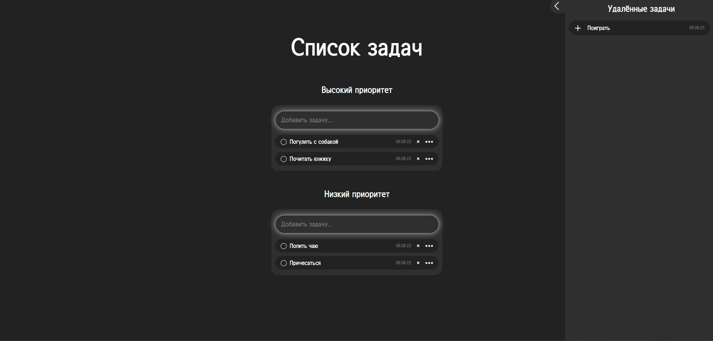

 

  

  <h3 align="center">ToDo</h3>

  

    Приложение для создания задач
  

## Table Of Contents

- [О проекте](#о-проекте)
- [Построен с помощью](#построен-с-помощью)
- [Начало работы](#начало-работы)
  - [Всё необходимое](#всё-необходимое)
  - [Установка](#установка)
- [Использование программы](#использование-программы)
- [Содействие](#содействие)
- [Создание запроса на слияние](#создание-запроса-на-слияние)
- [Лицензия](#лицензия)
- [Авторы](#авторы)
- [Благодарность](#благодарность)

## О проекте

В данном проекте я реализовал создание задач, их изменение, смену статуса задачи на выполненную, смену приоритета задач, удаление задач и возврат удалённых задач.

## Построен с помощью

1. [Инструмента для настройки среды разработки Vite.](https://vitejs.dev/)

2. [плагин eslint](https://www.npmjs.com/package/eslint)

3. [плагин moment](https://momentjs.com/)

## Начало работы

Чтобы локально запустить программу необходимо установить всё необходимое и активировать командами приведёнными ниже

### Всё необходимое

Список того, что вам необходимо сделать перед началом работы с проектом:

1. Клон моего репозитория в котором есть package.json

### Установка

1. Клонируйте себе мой репозиторий с программой

2. Скачайте [Node.js](https://nodejs.org/ru), если его у вас нет

3. Установите содержимое package.json командой npm install

4. Запуск программы осуществляется командой npm run dev

После всего этого программа откроется у вас в браузере.

## Использование программы

Приложение состоит из 1 вкладки:

1. ToDo - позволяет создавать задачи и управлять ими.

На странице присутствуют 2 поля которые можно заполнить, после заполнения задачи появятся под полем которое вы заполните в нужном приоритете

## Содействие

Вклады — это то, что делает сообщество открытого исходного кода таким замечательным местом, где можно учиться, вдохновляться и творить. Я очень ценю любой ваш вклад.

1. Если у вас есть предложения по добавлению или удалению проектов, не стесняйтесь открывать вопрос, чтобы обсудить его, или напрямую создать запрос на включение после того, как вы отредактируете файл README.md с необходимыми изменениями.

2. Пожалуйста, проверьте орфографию и грамматику. Создайте индивидуальный PR для каждого предложения.

3. Пожалуйста, также соблюдайте правила поведения, прежде чем опубликовать свою первую идею.

### Создание запроса на слияние

1. Разветвить проект

2. Создайте свою ветку (git checkout -b)

3. Зафиксируйте свои изменения (git commit -m "")

4. Push to the Branch (git push origin)

5. Откройте запрос на слияние

## Лицензия

Распространяется по лицензии MIT. См. [ЛИЦЕНЗИЯ](https://github.com/Kustiche/ToDo/blob/main/LICENSE) для получения дополнительной информации.

## Авторы

- **Акимов Александр** - _Frontend-разработчик_ - [Акимов Александр](https://github.com/Kustiche) - _Мой Git_

## Благодарность

- [Анна](https://github.com/enotstitch)
- [Константин](https://github.com/ZayRexan)
